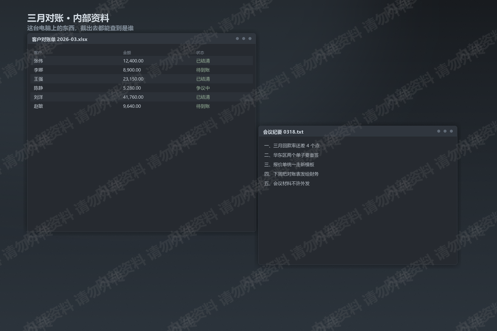
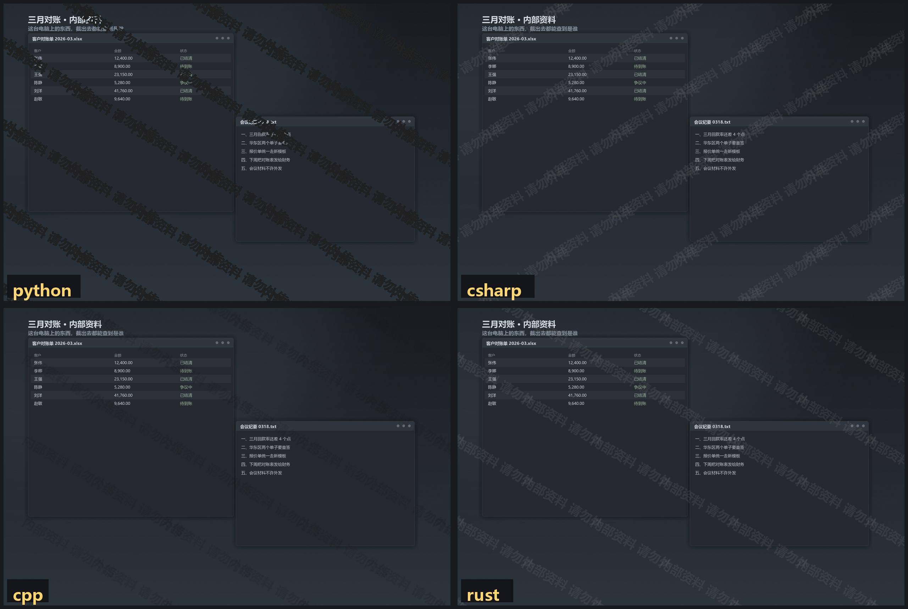
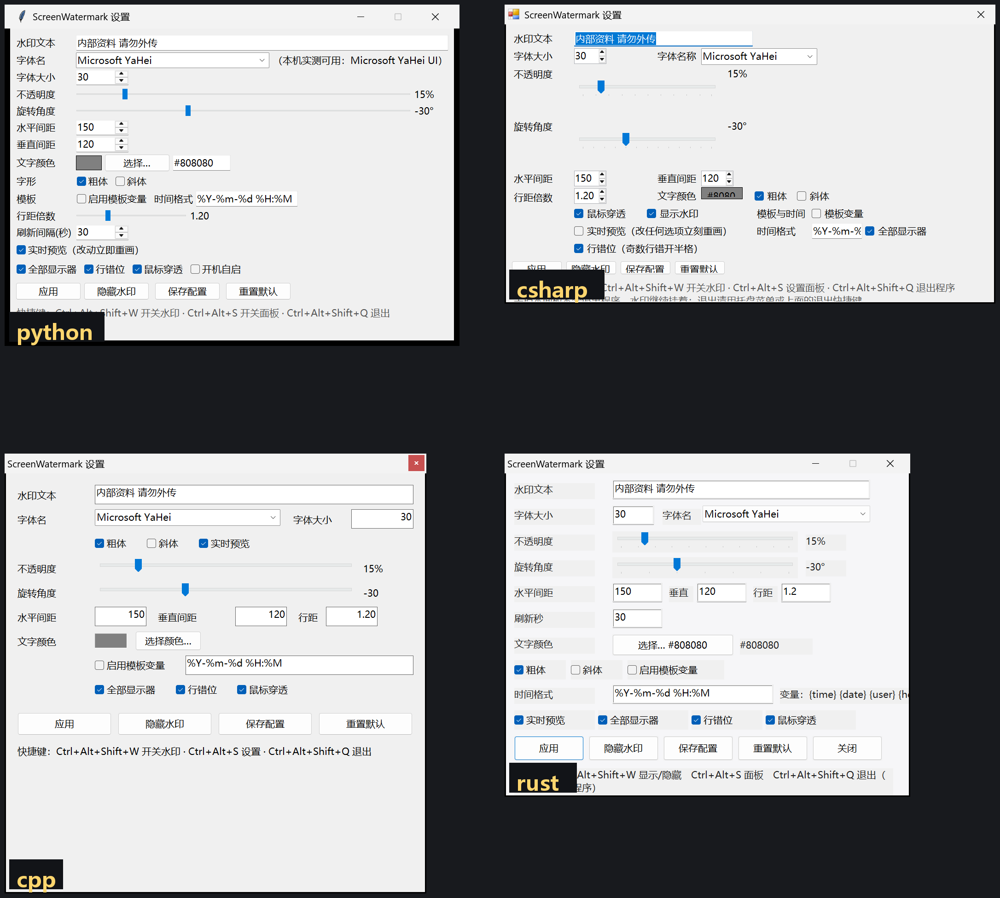

# ScreenWatermark

屏幕上盖一层灰灰的字。点得到鼠标下面，看不见它挡了什么，截图和录屏里却全是你写的字。

两块屏、四个字：**别外传**。

录屏、投屏、随手截个图，字都跟着你走。

Python、C#、C++、Rust 各写了一份，全部自己实现，没有引入任何第三方代码。

> **维护状态**
>
> 只有 **[C++ 版](cpp/) 继续更新**。
> Python、C#、Rust 三个版本**冻结在 1.0.0**——还能正常跑，但不再接新功能。
> 新配置项、新行为一律只进 `cpp/`。
>
> 提 issue 和 PR 请针对 C++ 版。另外三个只收"编译不过 / 一启动就崩"这类致命修复。

## 它长什么样



同一份 `config.json`，四个版本各自跑出来是这样（默认参数）：





## 能干什么

- 文字、字号、颜色、透明度、角度、间距，全都随你调
- 鼠标直接穿过去，桌面该怎么点还怎么点
- 设置面板改一个数字，水印立刻跟着变
- 多显示器每块屏都铺满，接投影仪不漏
- `Ctrl+Alt+W` 一键开关，老板来了再关
- 托盘常驻，关掉面板水印还在
- 配置存成 JSON，四个版本读同一份文件
- 水印里能塞时间、用户名、计算机名，谁截的图一查就知道
- 透明窗口不进任务栏、不抢焦点、Alt+Tab 里没有它

## 四个版本怎么选

想要的就挑 C++，剩下三个是当年一口气写出来对照用的，留着当参考实现。

| | 状态 | 依赖 | 适合 |
| --- | --- | --- | --- |
| [C++](cpp/) | **继续维护** | 系统自带 gdiplus | 日常就用它 |
| [Python](legacy/python/) | 冻结在 1.0.0 | 只用标准库 | 想快速改点东西试试 |
| [C#](legacy/csharp/) | 冻结在 1.0.0 | .NET Framework 4.8 | 手上只有 VS 的人 |
| [Rust](legacy/rust/) | 冻结在 1.0.0 | 无第三方 crate | 想看 Rust 怎么调 Win32 |

四个版本的配置格式完全一样，先用哪个调好参数，再把 `config.json` 丢给别的版本就行。
C++ 以后要是加了新字段，冻结的那三个会当成未知字段原样保留，不会读丢。

## Python 版

要 Python 3.10 以上，3.12 最好。

```bat
cd legacy\python
python main.py
```

就这样，没有 `pip install`。

命令行还能这么玩：

```bat
python main.py --text "机密 张三 2026-03-18"
python main.py --no-tray
python main.py --config D:\somewhere\my.json
python main.py -v
```

打成单个 exe：

```bat
cd legacy\python
build.bat
```

需要先 `pip install pyinstaller`，脚本会自己检查并告诉你。

## C# 版

已经编好的直接跑 `legacy\csharp\build\ScreenWatermark.exe`。

自己编：

```bat
cd legacy\csharp
build.bat
```

这个脚本调的是 Windows 自带的 C# 编译器，路径是
`%WINDIR%\Microsoft.NET\Framework64\v4.0.30319\csc.exe`。
不用装 .NET SDK，也不用装 Visual Studio。

装了 VS 的人可以直接开 `legacy\csharp\ScreenWatermark.csproj`。

目标框架是 .NET Framework 4.8，Win10 1809 以后系统自带。
别人拿到 exe 双击就能跑，不用装运行时。

## C++ 版

已经编好的直接跑 `cpp\build\ScreenWatermark.exe`。

自己编，用 MinGW：

```bat
cd cpp
build.bat
```

用 CMake（MSVC 或者 MinGW 都行）：

```bat
cd cpp
cmake -B build -DCMAKE_BUILD_TYPE=Release
cmake --build build --config Release
```

## Rust 版

已经编好的直接跑 `legacy\rust\target\release\ScreenWatermark.exe`。

自己编：

```bat
cd legacy\rust
build.bat
```

只依赖标准库，没有第三方 crate，不用连 crates.io。
Windows 这边建议用 GNU 工具链（`x86_64-pc-windows-gnu`），链接走 MinGW 的 gcc。

## 快捷键

| 按键 | 作用 |
| --- | --- |
| `Ctrl+Alt+W` | 开 / 关水印 |
| `Ctrl+Alt+S` | 开 / 关设置面板 |
| `Ctrl+Alt+Q` | 退出 |

关掉设置面板程序不会退，走托盘右键或者 `Ctrl+Alt+Q`。

**这几个键可能已经被别的软件占了。** 很多常驻程序（输入法、加速器、录屏工具）会抢
`Ctrl+Alt+W` 这类组合。抢不到的时候程序会自己退一级，改用 `Ctrl+Alt+Shift+W` 和
`Ctrl+Alt+Shift+Q`，并且把实际生效的组合写在日志和设置面板底部那行提示里。
两个都抢不到也不影响程序运行，只是那几个键用不了，托盘菜单照样能控制。

四个版本同时跑会互相抢同一组键，先注册的那个赢。一般情况下你只需要跑一个。

## 配置

程序同目录的 `config.json`，UTF-8。写不进去就落到 `%APPDATA%\ScreenWatermark\`。

```jsonc
{
  "text": "内部资料 请勿外传",
  "font_family": "Microsoft YaHei",
  "font_size": 30,
  "bold": true,
  "italic": false,
  "color": "#808080",
  "opacity": 0.15,
  "angle": -30,
  "gap_x": 150,
  "gap_y": 120,
  "line_spacing": 1.2,
  "enabled": true,
  "click_through": true,
  "template": false,
  "time_format": "%Y-%m-%d %H:%M",
  "refresh_seconds": 30,
  "all_monitors": true,
  "phase_offset": true,
  "autostart": false
}
```

几个容易调坏的：

- `opacity` 是 0.01 到 1.0。0.15 已经够看清了，别超过 0.3，不然看不清底下的东西
- `angle` 负数往右上歪，-30 是常见选择
- `gap_x` / `gap_y` 越大越稀，想密一点就调到 60 上下
- `click_through` 设 `false` 是调试用的，这时候水印会挡住鼠标

### 模板变量

`template` 打开以后，`text` 里这些词会被换掉：

| 变量 | 换成 |
| --- | --- |
| `{time}` | 当前时间，格式看 `time_format` |
| `{date}` | 今天，`2026-03-18` |
| `{user}` | 当前用户名 |
| `{host}` | 计算机名 |
| `{ip}` | 内网 IP，取不到就留空 |
| `{{` | 一个左花括号 |

比如：

```json
{
  "text": "{user}@{host} {time} 严禁截图",
  "template": true,
  "refresh_seconds": 30
}
```

时间会变，所以每隔 `refresh_seconds` 秒重画一次。

## 四个版本长得一样吗

接近，但不保证一个像素都不差。

平铺的算法、间距公式、颜色和透明度是共用的，所以整体观感一致。
差别在各自排版引擎量文字的方式：Python 走 Tk，C# 走 GDI+，C++ 走 GDI+，Rust 走 GDI+ flat API。
同一个字号，量出来的宽度会差几个像素，于是单元的疏密就跟着差一点。

想让它们看起来更接近，调 `font_size` 和 `gap_x` 就行。
配置文件本身是完全可以互换的，四个版本读的是同一套字段。

## 遇到问题

**水印不见了。** 先按 `Ctrl+Alt+W`。多半是被别的东西盖住了，正常情况程序每 3 秒会把自己顶回最前面。

**点不穿水印。** 看 `config.json` 里的 `click_through` 是不是被改成 `false` 了。

**字太密卡。** 把 `gap_x`、`gap_y` 调大，或者把 `font_size` 调小。极端参数下程序会自动稀疏，但能自己调就别让它兜底。

**托盘图标没出来。** 不影响用，快捷键和面板都在。重启一下资源管理器试试。

**四个版本配置打架。** 它们读的是同一份格式，但各自存各自的。要同步就手动拷 `config.json`。

## 目录结构

```
ScreenWatermark/
├── cpp/              主线，唯一在维护的实现：Win32 + GDI+
├── legacy/           冻结在 1.0.0 的三个参考实现
│   ├── python/       Python 版，只用标准库
│   ├── csharp/       C# 版，.NET Framework 4.8 + WinForms
│   └── rust/         Rust 版，Win32 FFI + GDI+，零第三方 crate
├── docs/DESIGN.md    四个实现共用的规格，改行为先改这里
└── docs/shots/       截图
```

## 已知问题

都是实话，没有藏着：

- **多显示器没在真机上验过。** 开发机只有一块屏（2520x1680，175% 缩放），
  "每块屏一个水印窗"这段代码四个版本都写了，但只跑通了单屏路径。
- **`Ctrl+Alt+W` 和 `Ctrl+Alt+Q` 在开发机上被别的软件占着**，
  所以四个版本实测过的是**降级路径**（`Ctrl+Alt+Shift+W/Q`），首选路径反而是靠代码推的。
- **改完 `config.json` 不一定自动生效。** 开发机的 `FileSystemWatcher` 完全不工作
  （D 盘和 C:\Temp 都收不到事件），C# 版的外部热载在本机因此无效。
  四个版本都留了「重新载入配置」（面板按钮或托盘菜单）当替代。
- **托盘图标**能创建，但右键菜单和双击是人工交互，没做自动化测试。
- `{ip}` 模板变量没实测，只测了 `{time}` / `{date}` 的定时刷新链路。
- 混合 DPI 的多显示器上，字号按水印窗所在那块屏算，两块屏看起来会差一点点。

## 给要改代码的人

这几条是踩出来的，改之前先看一眼：

- **`.bat` 里只写 ASCII。** cmd 按 OEM 代码页解析批处理，UTF-8 的中文 `echo`
  会被切成半截字节，变成"不是内部或外部命令"，构建莫名其妙就断了。
- **`.ps1` 里也只写 ASCII。** Windows PowerShell 5.1 把无 BOM 的 UTF-8 脚本按 GBK 读，
  中文注释里某些字节序列会吐出一个引号，把后面的 here-string 整个吃掉，
  然后报一堆看不懂的 C# 语法错。
- **编 C# 要加 `/codepage:65001`。** csc 按系统代码页读无 BOM 源文件，
  不加的话中文字符串会双重编码写进 `config.json`——文件是合法 UTF-8，内容却是乱码。
- **验证脚本第一句设 DPI 感知**（`SetProcessDpiAwarenessContext(-4)`）。
  开发机 175% 缩放，DPI-unaware 的进程会把 2520x1680 的窗口报成 1440x960，
  看起来像"窗口尺寸不对"。

## 开源协议

AGPL-3.0-or-later，全文见 [LICENSE](LICENSE)。

简单说：拿去用、拿去改、拿去卖都行，但你改完再发布（包括做成网络服务让人用）必须也开源。水印工具这东西，本身就是为了留痕，协议上也别想着擦掉。

